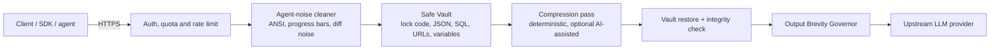

# Curtly — LLM Prompt Compression API & Token Optimization Proxy

[](https://curtly.dev)
[](docs/api-reference/chat-completions.md)
[](openapi.yaml)
[](LICENSE)

**Curtly** is a hosted API that reduces the number of tokens you send to, and receive from, large language models. It compresses prompts, RAG context, agent tool output and chat history *before* they reach the model, and nudges the model toward shorter answers on the way back, so you pay for fewer input **and** output tokens.

> **About this repository.** This is the public documentation, API reference and technical overview for Curtly. **Curtly itself is a closed-source hosted service** and its source code is not published here. Get an API key at **[curtly.dev](https://curtly.dev)**.

---

## Table of contents

- [What Curtly does](#what-curtly-does)
- [Quickstart](#quickstart)
- [Two ways to integrate](#two-ways-to-integrate)
- [How it works](#how-it-works)
- [Documentation](#documentation)
- [Benchmarks (honest summary)](#benchmarks-honest-summary)
- [Supported models and tokenizers](#supported-models-and-tokenizers)
- [Security and privacy](#security-and-privacy)
- [FAQ](#faq)
- [License and status](#license-and-status)

## What Curtly does

LLM bills scale with tokens, and much of what you send is not information: repeated instructions, boilerplate, license headers, ANSI escape codes from terminals, verbose JSON, pleasantries. Output tokens typically cost several times more than input tokens, so verbose answers are the more expensive half.

Curtly runs two stages:

| Stage | What happens | Where it saves |
|---|---|---|
| **1. Input compression** | Strips filler and redundancy from prompts, RAG chunks and agent context while *vaulting* code, JSON, SQL, URLs and template variables so they are never touched (the [Safe Vault](docs/safe-vault.md)). | Input tokens |
| **2. Output Brevity Governor** | Adds a concise-answer directive so the model skips greetings, apologies and repeated summaries. Levels: `lite`, `full`, `ultra`, `off`. | Output tokens |

## Quickstart

### Option A — Compression API (you call your LLM yourself)

```bash
curl -X POST https://curtly.dev/api/v1/compress \
  -H "Authorization: Bearer $CURTLY_API_KEY" \
  -H "Content-Type: application/json" \
  -d '{
    "prompt": "You are a customer support agent. Please make sure that you always greet the customer warmly and never issue refunds above $50.",
    "mode": "balanced"
  }'
```

The response contains the compressed text, token counts before and after, the tokenizer used, latency, and an integrity flag. See the [`/v1/compress` reference](docs/api-reference/compress.md).

### Option B — Drop-in OpenAI-compatible proxy

```python
from openai import OpenAI

client = OpenAI(
    base_url="https://curtly.dev/api/v1",
    api_key="ctly_live_...",  # your Curtly key
)

resp = client.chat.completions.create(
    model="gpt-4o",
    messages=[{"role": "user", "content": "Explain this stack trace ..."}],
    extra_headers={"X-Curtly-Mode": "balanced"},
)
```

Curtly compresses the messages, forwards the request to your configured upstream provider, and streams the answer back. See the [`/v1/chat/completions` reference](docs/api-reference/chat-completions.md) and [integration examples](docs/integrations.md).

## Two ways to integrate

| | `POST /api/v1/compress` | `POST /api/v1/chat/completions` |
|---|---|---|
| Use when | You want compressed text back and will call the model yourself | You want a transparent proxy in front of an OpenAI-compatible client |
| Returns | Compressed prompt + stats | Normal chat-completion response (streaming supported) |
| Upstream provider | Not involved | OpenRouter, OpenAI, Anthropic, Groq or a custom OpenAI-compatible base URL (bring your own key) |
| Output brevity | Returns a directive you can append | Injected for you |

## How it works



The design goal is *lossless where it matters*: anything structural is locked away before text compression runs and restored byte-for-byte afterwards. Read the full [architecture overview](docs/how-it-works.md).

## Documentation

| Topic | Link |
|---|---|
| Architecture and pipeline | [docs/how-it-works.md](docs/how-it-works.md) |
| Safe Vault (syntax protection) | [docs/safe-vault.md](docs/safe-vault.md) |
| Compression modes | [docs/compression-modes.md](docs/compression-modes.md) |
| Authentication and API keys | [docs/api-reference/authentication.md](docs/api-reference/authentication.md) |
| `POST /api/v1/compress` | [docs/api-reference/compress.md](docs/api-reference/compress.md) |
| `POST /api/v1/chat/completions` | [docs/api-reference/chat-completions.md](docs/api-reference/chat-completions.md) |
| `GET /api/v1/models` | [docs/api-reference/models.md](docs/api-reference/models.md) |
| Errors, quotas and rate limits | [docs/api-reference/errors-and-limits.md](docs/api-reference/errors-and-limits.md) |
| Integrations (OpenAI SDK, Node, LangChain, cURL) | [docs/integrations.md](docs/integrations.md) |
| Benchmarks and methodology | [docs/benchmarks.md](docs/benchmarks.md) |
| Models and tokenizers | [docs/models-and-tokenizers.md](docs/models-and-tokenizers.md) |
| Security and privacy | [docs/security-and-privacy.md](docs/security-and-privacy.md) |
| FAQ | [docs/faq.md](docs/faq.md) |
| Machine-readable spec | [openapi.yaml](openapi.yaml) · [llms.txt](llms.txt) |

## Benchmarks (honest summary)

Measured results from Curtly's own live benchmark runs (September 2026, upstream model `cohere/north-mini-code:free` via OpenRouter). Savings depend heavily on the prompt: verbose prose compresses a lot, dense code and JSON compress little by design.

| Workload type | Typical input-token reduction |
|---|---|
| RAG / documentation context | 20% – 90% |
| Customer-support threads, email boilerplate | 15% – 89% |
| Agent context with terminal noise | 20% – 79% |
| Dense code and structured JSON | 0% – 25% (protected on purpose) |

Output brevity cut completion tokens by **70.1%** across a 6-workload run, but on prompts with little redundancy the *input* side saved nothing. Full tables, including the cases where Curtly did not help, are in [docs/benchmarks.md](docs/benchmarks.md). Please measure on your own traffic before relying on any number.

## Supported models and tokenizers

Token counts use the tokenizer family that matches your target model (OpenAI `o200k_base`, Claude BPE, DeepSeek/Llama 128k, Gemini SentencePiece, Qwen, GLM and more), so savings are reported in the units you are billed in. See [docs/models-and-tokenizers.md](docs/models-and-tokenizers.md).

## Security and privacy

- Prompt and response text is processed in memory; usage logs store token counts and latency, not prompt content.
- API keys are stored as SHA-256 hashes and support scopes and expiry.
- Your upstream provider key is used per request and is not persisted when sent inline.

Details and honest limits: [docs/security-and-privacy.md](docs/security-and-privacy.md).

## FAQ

**What is Curtly?**
A hosted LLM prompt compression API and OpenAI-compatible proxy that reduces input and output token usage.

**Is Curtly open source?**
No. This repository is documentation only. The service is proprietary and hosted at [curtly.dev](https://curtly.dev).

**Will compression break my code or JSON?**
Code blocks, inline code, JSON, SQL, URLs and template variables are locked in the Safe Vault before compression and restored afterwards, with an integrity check on every response. See [Safe Vault](docs/safe-vault.md).

**Does it work with the OpenAI SDK?**
Yes. Point `base_url` at `https://curtly.dev/api/v1` and use your Curtly key. See [integrations](docs/integrations.md).

**How much will I save?**
It depends on your prompts. See the [benchmarks](docs/benchmarks.md) for the full range, including cases with no input savings. More answers in the [FAQ](docs/faq.md).

## License and status

Documentation in this repository is licensed under [CC BY 4.0](LICENSE). The Curtly software and service are **not** covered by that license and remain proprietary. If you cite this project, see [CITATION.cff](CITATION.cff).

**Keywords:** LLM prompt compression, token optimization, reduce OpenAI API cost, reduce Claude API cost, prompt compression API, context compression, RAG context compression, LLM gateway, OpenAI-compatible proxy, token counter, output token reduction, AI agent context pruning.

<!-- update: v1 -->
<!-- update: v2 -->
<!-- sync: 2026-10-08-r1 -->
