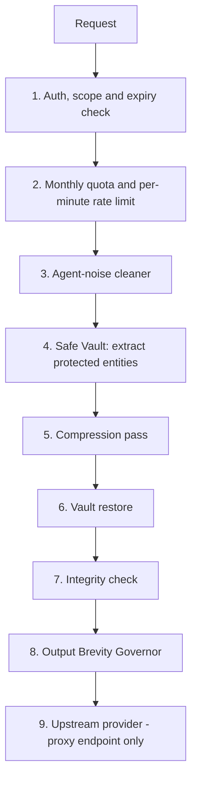

# How Curtly works

Curtly sits between your application and an LLM. It shrinks what goes in, and asks the model to be brief about what comes out. This page describes the pipeline at an architectural level. Internal heuristics and thresholds are intentionally not published.

## Why token compression is worth doing

- **Cost scales with tokens.** Both prompt and completion tokens are billed, and completion tokens typically cost several times more per token.
- **Context bloat is common.** System prompts, tool definitions, RAG chunks, long chat histories and terminal output routinely contain repetition and formatting noise.
- **Latency scales with input too.** Fewer prompt tokens means less prefill work upstream.
- **Agents amplify the problem.** Coding agents resend large contexts on every turn, including ANSI color codes, progress bars and diff headers that carry no meaning for the model.

## Pipeline

1. **Auth.** API keys are looked up by SHA-256 hash, then checked for revocation, expiry and scope. See [authentication](api-reference/authentication.md).
2. **Quota and rate limiting.** A monthly request quota per plan and a sliding-window per-minute limit. See [errors and limits](api-reference/errors-and-limits.md).
3. **Agent-noise cleaner.** Removes content that is meaningless to a model: ANSI escape sequences, terminal progress bars, repeated status lines.
4. **Safe Vault.** Code fences, inline code, JSON, SQL, URLs, file paths and template variables are replaced with collision-resistant placeholders. See [Safe Vault](safe-vault.md).
5. **Compression pass.** Deterministic rules remove filler and redundancy. Depending on the mode and key settings, an optional AI-assisted step can distill prose further. See [compression modes](compression-modes.md).
6. **Vault restore.** Placeholders are swapped back for the original entities.
7. **Integrity check.** Curtly verifies that every protected entity survived. The result is exposed as `integrityPassed` in the body and `X-Curtly-Integrity` in the headers.
8. **Output Brevity Governor.** A directive that asks the model to skip greetings, apologies and repeated summaries. Configurable with `X-Curtly-Brevity`.
9. **Upstream call.** On the proxy endpoint only, the compressed messages are forwarded to your configured provider and the response is streamed back.

## Design principles

- **Lossless where it matters.** Structure is locked, prose is compressed.
- **Deterministic by default.** The default path is rule-based and fast; AI-assisted compression is opt-in per request or per key.
- **Adaptive routing.** Very short messages skip the AI-assisted step, since there is little to gain and latency would dominate.
- **Prefix-cache friendliness.** Live runs kept system prompts stable across turns so provider-side prompt caching keeps working. Verify this on your own provider.
- **Measured in billing units.** Savings are counted with the tokenizer family of the target model, not a generic character count.

## What Curtly does not do

- It does not summarize away facts on purpose; it removes redundancy. Aggressive modes trade more risk for more savings.
- It does not guarantee a fixed percentage. Dense code and JSON compress little by design.
- It is not a vector database or a retrieval system.

Continue with [compression modes](compression-modes.md) or the [API reference](api-reference/compress.md).
